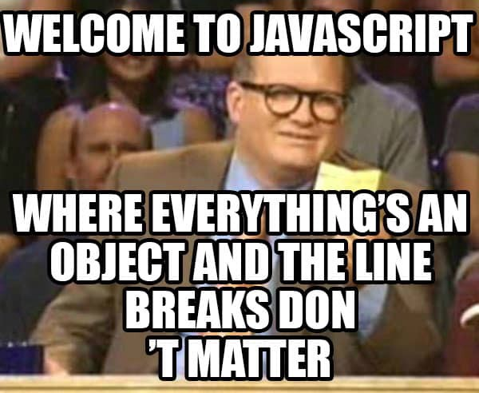

*The Ugly Beauty of Javascript*



If economics ever taught us anything, it's that people always face trade-offs. It's the principle that you must give something up in order to get something else. You want to make something better? Then you have to let something else worsen. To me, Javascript models this economic principle quite well, but maybe not in an obvious way. 


## The Gains 

Sometimes the most innovative and progressive ideas are the result of a bold decision to challenge a fundamental that has existed since the beginning. Javascript does just that by seemingly doing away with variable typings, and instead it just allows variables to exist. Want to declare a variable? Then do it! You don't need to worry if it's going to be a float, an integer, or a string until you actually have to use it. Now this is where Javascript is beautiful, the values of variables can be set to anything later on in the code because varaibles are not constricted to a single type. This allows for the swift creation of functions that can return both integers and strings without requiring additional code to change the type of the return variable. You can even input a variety of variable types and have the function respond to specific types of variables as well. It is great for developing programs whose inputs and outputs could potentially be quite random.

```
// declare a variable
var = anything;

// a function that can return multiple types
function returnAnything(num) {
  if (num > 0) {
    return "Positive";
  } 
  else if (num < 0) {
    return -1.5;
  }
  else if (num == 0) {
    return 0;
  }
}
```

## The Trade-off

Despite how great Javascript can be, it unfortunately is not the perfect programming language - otherwise everyone would be using it. As I mentioned before, we always face trade-offs. With Javascript we gain a language that allows for more efficient coding, but at the same time you could end up with code that looks more complicated and messier than usual. Shorter functions and code are a breeze in Javascript, but once you start coding something that's more than a hundred lines you could have quite the mess of symbols on your computer. If you are not using a Javascript Integrated Development Environment (IDE) it could take a while to find a small syntax error whether it's an undeclared variable, a missing comma, an incorrect bracket or brace, etc. 

If you have a syntax error in this code, it might almost be quicker to retype everything instead of searching for the error.
```
work": [
    {
      "company": "A",
      "position": "Research Assistant",
      "website": "site.com",
      "startDate": "2017-11-01",
      "endDate": "Present",
      "summary": "",
      "highlights": [
        "highlight1",
        "highlight2"
      ]
    },
    {
      "company": "B",
      "position": "Curriculum Editor",
      "website": "",
      "startDate": "2017-06-01",
      "endDate": "2017-10-01",
      "summary": "Edited and updated curriculum",
      "highlights": [
        "highlight1"
      ]
    },
    {
      "company": "C",
      "position": "Host",
      "website": "",
      "startDate": "2015-08-24",
      "endDate": "2016-08-10",
      "summary": "sit people",
      "highlights": [
        "highlight1",
        "highlight2"
      ]
    }
  ]
```

There seems to be plenty of potential in utilizing Javascript in programming, but if a person were to use it without the proper amount fo expertise then things could go wrong rather quickly. Perhaps this makes Javascript a less efficient language for higher level programming for general users. At the hands of a skilled veteran however, Javascript could be a dream come true. 
