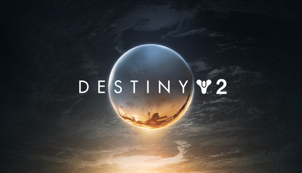
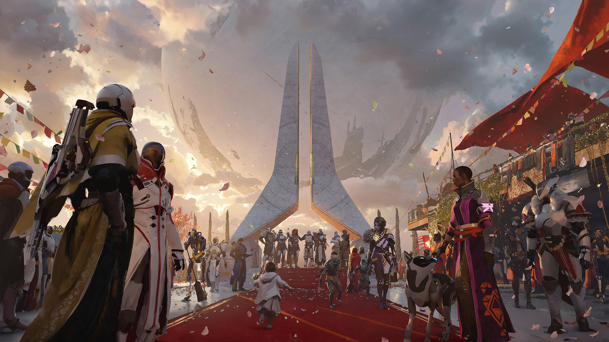
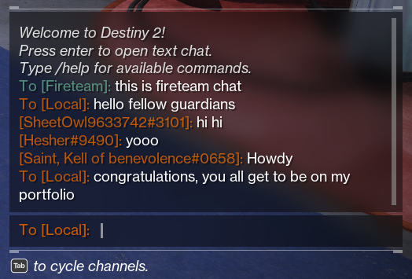
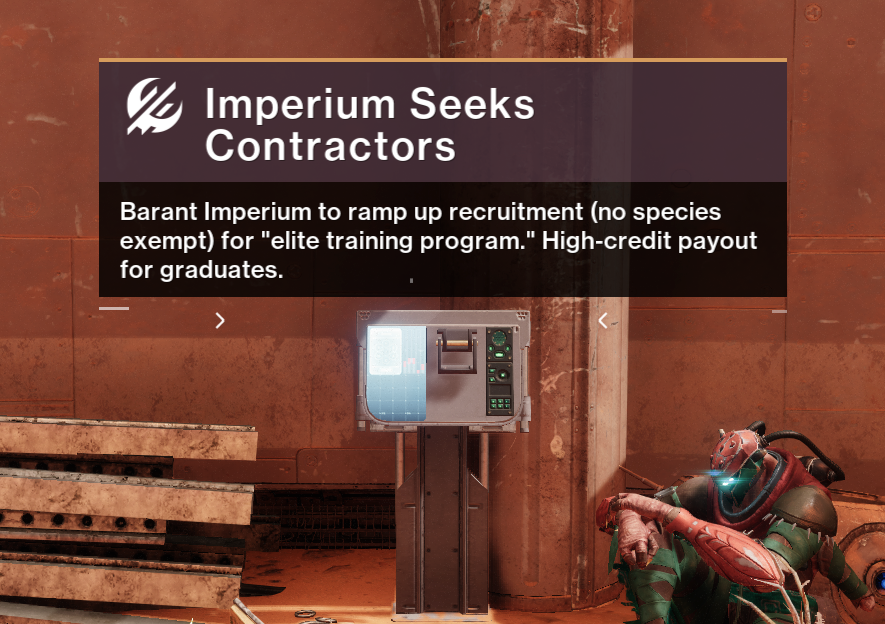
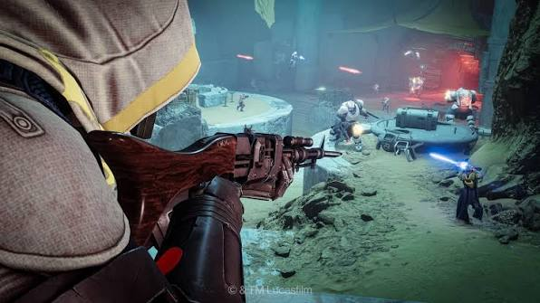

  

    <h1 class="ui center aligned header" style="font-size: 40px; color: whitesmoke">{{ page.title }}</h1>
    
    

      
C++

      
C#

      
Python

      
Perforce

      
Networking

    

    

      Destiny 2 is a AAA First Person Shooter MMORPG released by Bungie in 2017. It is available on PlayStation, Xbox, and PC.
    

  

  

    

    

      
      

        I joined Bungie as an intern in May of 2021 and became a full time Gameplay Engineer in January of 2022. During my time at Bungie, I had the privilege of working on the Destiny 2 project. While I am not at liberty to publicize every contribution I made to Destiny 2, there are a few features I worked on that you can see in game for yourself which I am allowed to discuss.
      

      

        

          

            
          

          

            Text Chat
          

        

        

          

            
          

          

            Activity Tooltips
          

        

        

          

            
          

          

            Invasions
          

        

      

    

    

  

  

<!-- text chat -->

  

    
    <h1 class="ui center aligned header" style="font-size: 40px; color: whitesmoke">Text Chat</h1>
  

  

    

    

      

       I joined Bungie in the summer of 2021 to help finish the development of cross-play in Destiny 2. One of the major components to cross-play was updating the text chat system to use the new Bungie accounts to allow players on console and PC to use it to communicate with each other. This required reworking the existing text chat commands to use Bungie names instead of platform names. To do this, I had to learn how the text chat system processed user input and how auto complete functioned for player and command names.
      

      
    

    

  

  

    

    

      

        I also created three new text chat commands: report, block, and unblock. These commands were a bit special because we needed to send data from the text chat system to UI elements that would appear when using them. The unblock command was actually my own idea that I proposed to the team. I felt it would be a good addition because while you could block anyone from inside the game, there wasn't anyway to unblock someone without having to go to their account settings on the Bungie website.
      

      

        

          
        

        

          
        

      

    
 
    

  

  

    

    

      

        

          Long after we had shipped cross-play, I added another new command called clear to give players the ability to clear their local text chat view. This was something my manager and I pushed for after seeing online feedback about how there was no way to get rid of any profanities in a player's text chat history without logging out of the game.
        

      

      

        
      

    

    

  

  

    

    

      

       Along with my work on text chat, I had the opportunity to work on some other critical features. For example: many of the system messages you see when using text chat are from me! So whenever you see them, know that I am the one speaking directly to you...
      

      
      

       ...okay maybe I'm not literally talking to you, but I did write those messages. Another contribution of mine was writing code to make sure that a player could always be blocked immediately even if a user's block list was full on our servers.
      

    

    

  

  

    

    

      

        Much of my work on cross-play and text chat was also used for Marathon.
      

      

        

          
        

        

          
        

      

    
 
    

  

  

<!-- activity tooltips -->

  

    
    <h1 class="ui center aligned header" style="font-size: 40px; color: whitesmoke">Activity Tooltips</h1>
  

  

<!-- invasions -->

  

    
    <h1 class="ui center aligned header" style="font-size: 40px; color: whitesmoke">Invasions</h1>
  

  

    

    

      

       For the Renegades expansion in Destiny 2, project leadership wanted to experiment with a new PvEvP game mode. The idea was to have one team of up to 3 players play through a typical PvE activity, but in the middle of this activity a 4th player could invade them to hunt them down in PvP gameplay.
      

      
      

       I was tasked with driving the implementation of the technical side of invasions. My work involved updating activity systems for the PvEvP framework of the activity, configuring and updating matchmaking systems to support a unique matchmaking setup, and working directly with the design team to advise them on their content setups and identify what they needed from engineering.
      

    

    

  

  

    

    

      

       The setup for invasions had 2 invadable queues where one would rotate every 24 hours and the other would rotate every 15 minutes. This led to concerns from design about players who may try to dodge being invaded by waiting to select a queue until right before the rotation time. Engineering also still had some remaining worries about the 15-minute rotation being too short such that it would split the matchmaking population and put invaders at risk of not finding games. To resolve these fears, I wrote a new matchmaking feature in our engine that performs a smart queue selection for players entering matchmaking based on the current population of available games in each queue.
      

    

    

  

  

    

    

      

        

          On the activity side, I was responsible for making a new setting to allow for a PvE activity to automatically assign players to PvP teams. I also created a new gameplay system to support making certain enemy AI factions allied with specific player teams so that invaders would be friendly with enemy AI.
        

      

      

        
      

    

    

  

  

    

    

      

        When invasions went live to the public with the launch of the Renegades expansion, we saw a very healthy success rate of matchmaking for invading players. We also saw almost all sessions on the PvE side were being matched onto by an invader. 
         
         
        You can view a showcase of the feature from the live game here:
      

      

        <iframe width="900" height="506" src="https://www.youtube.com/embed/s1JojyBBGdc?si=6GfK1VAB0srLjgww" frameborder="0" allow="accelerometer; autoplay; encrypted-media; gyroscope; picture-in-picture" allowfullscreen></iframe>
      

    

    

  

