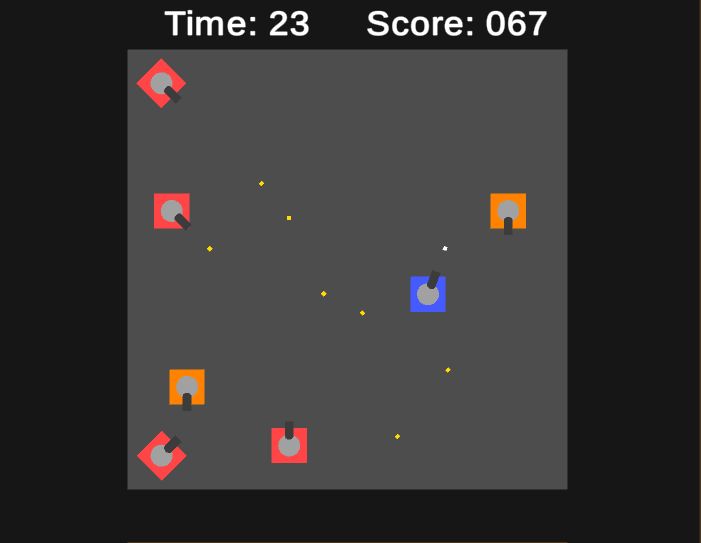
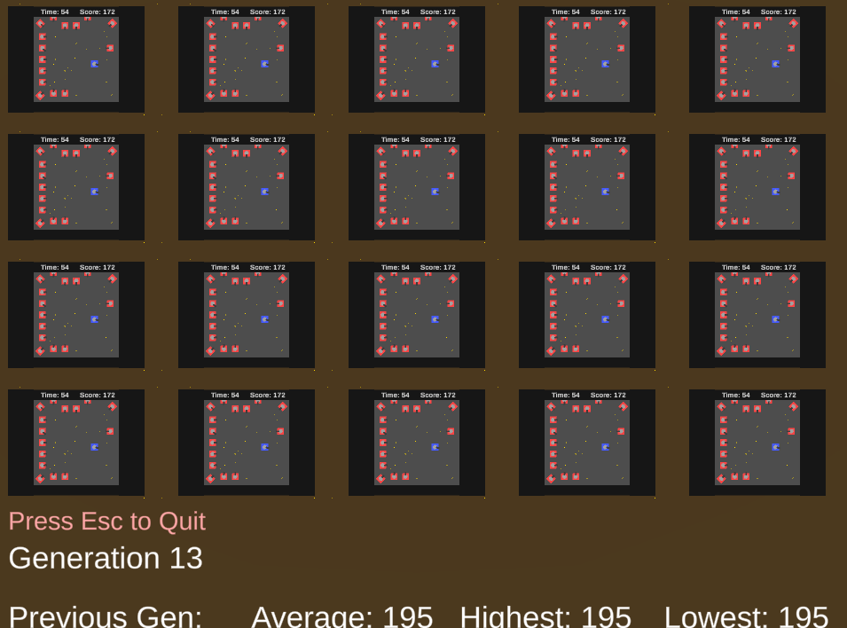

  
Artificial Intelligence

  
Evolutionary Computation

  
Game Design

  
Unity

  
C#

 

"EvoTank" is a 2D tank game that simulates an AI tank player battling other tanks in an arena. The game uses a genetic evolutionary algorithm to improve the AI tank player and attempts to optimize its performance by maximizing its score. The game was a solo project developed in Unity and C#.

Designing the AI tank player proved to be a challenging task even though I have previously worked on simple game AI systems before. The AI had to be made to mimic behaviors a human player could make in such a game, so I came up with a few different settings for its main attributes. For its movement behavior it could either only move when it was necessary to dodge enemy fire, or it could move randomly until it was necessary for it to dodge. For the shooting method, the tank could either shoot at enemies randomly, fire at the closest enemies first, or prioritize the furthest enemies. The other attribute that could be adjusted was the range at which the tank detects if a bullet will hit it. This was done to mimic how different players will decide to dodge bullets early or only right before they hit. The movement speed and fire rate of the tank were left unchanged since increasing those would clearly improve the AI tank's performance.  

Implementing the genetic algorithm for this project was quite interesting. Strangely, the biggest problem I had was making sure the AI would not evolve too quickly. This was an issue because it could lead to the AI evolving toward suboptimal parameters without properly exploring all possibilities. I utilized a tournament selection algorithm for the selection of parents from each generation to ensure that the best member of the population is chosen. I also made use of a k-nearest neighbors mutation algorithm to help the population converge on the optimal parameters and allow it to search beyond the exisitng values within the population. 

For more detailed information about this project and its implementation you can read the following [paper](https://jkbishay.github.io/projects/EvoTank_Paper.pdf) on it.

  

    
    
  

