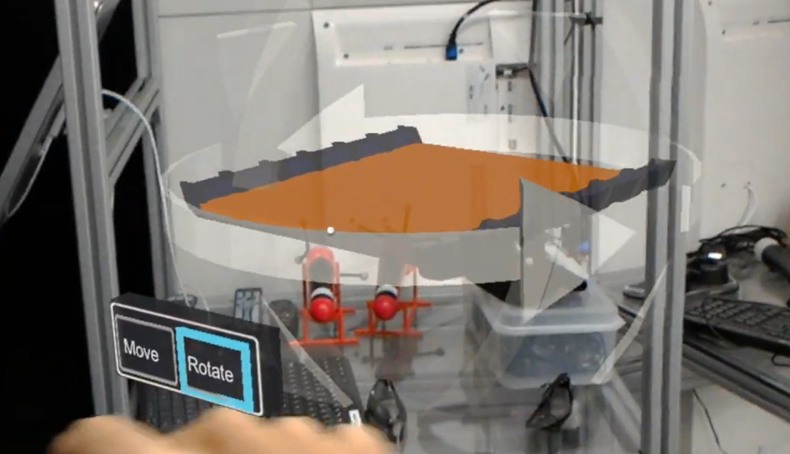

  

    <h1 class="ui center aligned header" style="font-size: 40px; color: whitesmoke">{{ page.title }}</h1>
    
    

      
C#

      
Unity

      
Augmented Reality

      
3D Modeling

      
Blender

    

    

      HoloRacer is an augmented reality car racing game created in the Unity engine for Microsoft's HoloLens.
    

  

  

    

    

      

        
      

      

        

          The player can build a race track in their real world space and race a car around it. The race track pieces and warp portals were modeled and colored by myself in Blender. Through this I learned quite a bit about the pipeline of art asset creation and importing them into a game engine. 
           
           
          To make it more of a complete game experience, I decided to add AI racer opponents. To do this, I created a waypoint system allowing users to place markers along the track by leveraging Unity's AI pathfinding system to guide them to the next waypoint marker.
        

      

    

    

  

  

    

    

      

        My professor suggested that I should leverage the augmented reality technology to do something that is not possible in reality. That inspired me to utilize the HoloLens's spatial mapping capabilities to generate a physics mesh around the player's environment that the cars can drive on.
      

      
      

        I decided to take this concept one step further and implemented a way for players to change the gravity direction such that you can do something like racing on the ceiling.
      

      
    

    

  

  

    

    

      

        

          Part of the motivation for this project was self directed research around possible methods for placing and manipulating virtual objects in augmented reality space. This was a challenging problem when working in the HoloLens because the HoloLens was limited to a single tap gesture for tap and tap and hold inputs.
           
           
          I decided to set up each track piece with a set of buttons to control if it was in move or rotate mode. Move mode simply allowed for the piece to be grabbed and repositioned freely, while rotate mode would reveal curved arrows along each axis to allow users to grab on an arrow and rotate the object along the desired axis without it moving position.
        

      

      

        
      

    

    

  

  

    

    

      

        This was a solo project I worked on during my time as an undergraduate research assistant. It allowed me to explore some of the possibilities of game design with augmented reality technology. HotWheels was a large inspiration for this project as it was one of my favorite toys to play with when I was a kid. The goal was to bring to life the idea of racing cars around the player's environment in whatever crazy way they desired. 
         
         
        I presented this project at a social software showcase event called WetWare Wednesday in November of 2018. The project was received well amongst spectators at the event. It is capable of featuring up to 5 AI cars at once guided by a waypoint system that can be setup by the player. A demo of the project can be viewed here:
      

      

        <iframe width="900" height="506" src="https://www.youtube.com/embed/TOoPjq2TaMk" frameborder="0" allow="accelerometer; autoplay; encrypted-media; gyroscope; picture-in-picture" allowfullscreen></iframe>
      

    

    

  

