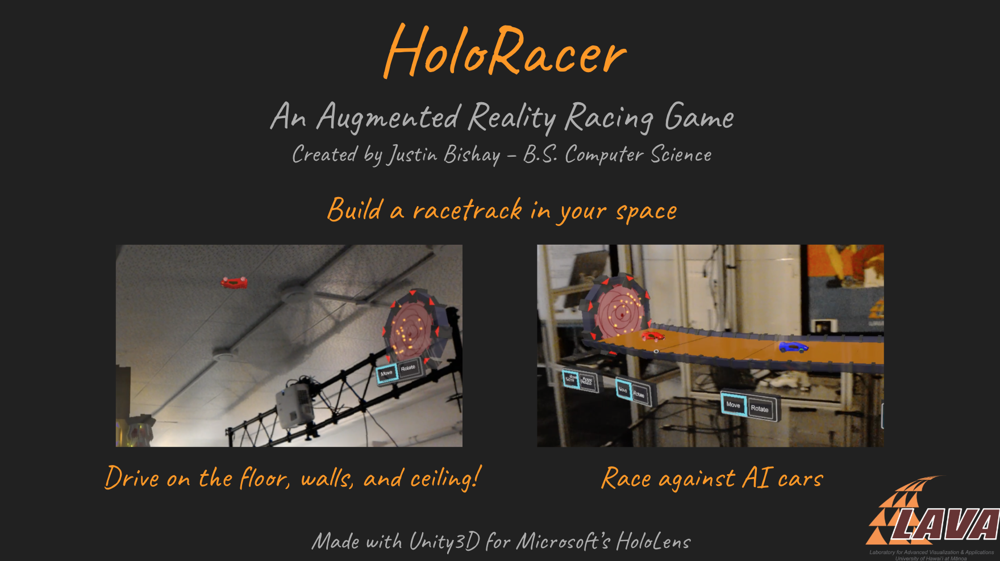
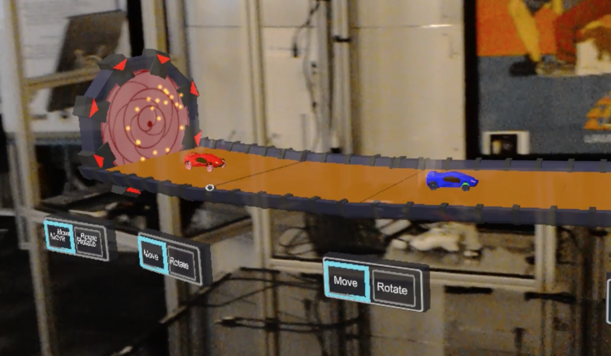
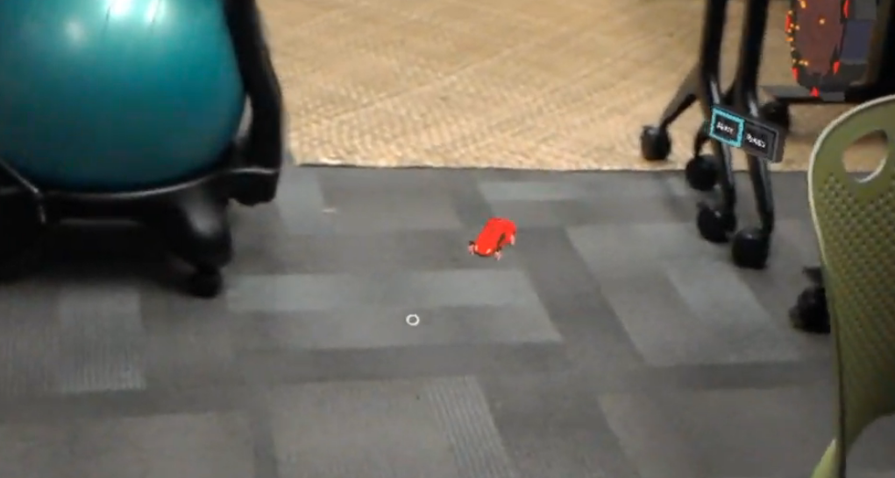
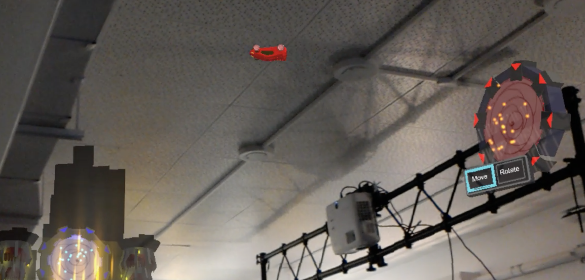
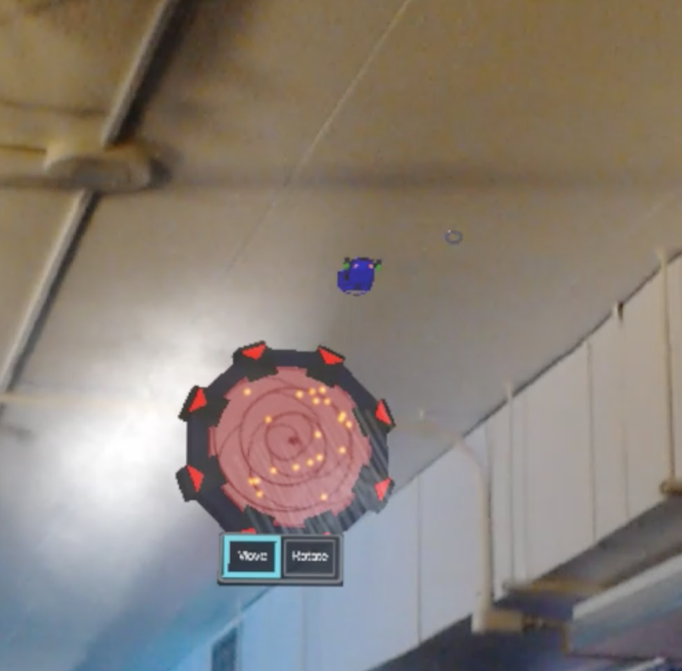

  

    <h1 class="ui center aligned header" style="font-size: 40px; color: whitesmoke">{{ page.title }}</h1>
    
    

      
C#

      
Unity

      
Augmented Reality

      
3D Modeling

      
Blender

    

    

      HoloRacer is an augmented reality car racing game created in the Unity engine for Microsoft's HoloLens.
    

  

  

    

      

        
      

      

        

          The player can build a race track in their real world space and race a car around it. The race track pieces and warp portals were modeled and colored by myself in Blender. Through this I learned quite a bit about the pipeline of art asset creation and importing them into a game engine. 
           
           
          To make it more of a complete game experience, I decided to add AI racer opponents. To do this, I created a waypoint system allowing users to place markers along the track by leveraging Unity's AI pathfinding system to guide them to the next waypoint marker.
        

      

    

  

  

    

      

        My professor suggested that I should leverage the augmented reality technology to do something that is not possible in reality. That inspired me to utilize the HoloLens's spatial mapping capabilities to generate a physics mesh around the player's environment that the cars can drive on.
      

      
      

        I decided to take this concept one step further and implemented a way for players to change the gravity direction such that you can do something like racing on the ceiling.
      

      
    

  

 

"HoloRacer" is an augmented reality car racing game. The player can build a race track and drive a car around it. The player can also set up waypoints to spawn AI cars. It is also possible to take advantage of being in augmented reality to drive the cars on the surfaces in the player's environment. This game was a solo project created in Unity for Microsoft's HoloLens.

HotWheels was a large inspiration for this project as it was one of my favorite toys to play with when I was a kid. The goal was to bring to life the idea of racing cars around the player's environment in whatever crazy way he or she desired. The HoloLens's spatial mapping capabilities provided the possibility of driving a car on floors, walls, and ceilings in addition to a digital track. In order to truly take advantage of this, my professor suggested that I should do something that is not possible in reality. This led me to create teleporters and gravity shifting to allow players to create large tracks that can drive on the walls and ceiling. Because I did not have anyone assisting me with this, I had to create or find assets myself. The car and car AI were provided by Unity's sample assets package. However, I created all of the race track models myself using Blender. This was my first time using Blender for 3D modeling, so it taught me a little bit about the creation and importing of art assets into a game engine like Unity. 

I presented this project at a social software showcase event called WetWare Wednesday in November of 2018. The project was received well amongst spectators at the event. It is capable of featuring up to 5 AI cars at once guided by a waypoint system that can be setup by the player. 

  <iframe width="700" height="394" src="https://www.youtube.com/embed/TOoPjq2TaMk" frameborder="0" allow="accelerometer; autoplay; encrypted-media; gyroscope; picture-in-picture" allowfullscreen></iframe>

  

    
    
    
  

  

  

