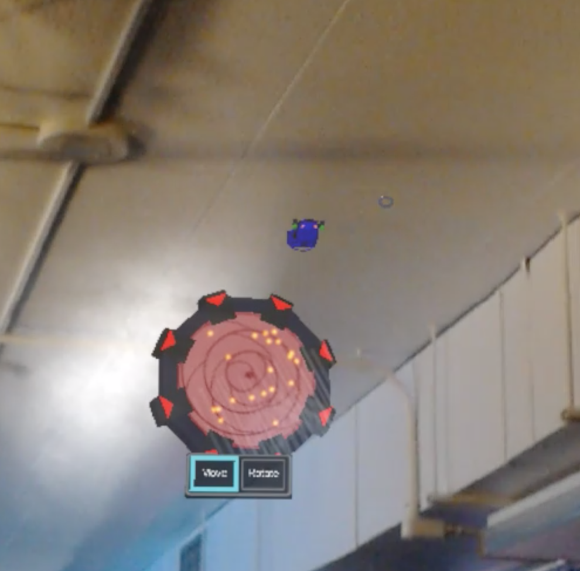

  
Augmented Reality

  
Game Design

  
3D Modeling

  
Unity

  
C#

  
Blender

 

"HoloRacer" is an augmented reality car racing game. The player can build a race track and drive a car around it. The player can also set up waypoints to spawn AI cars. It is also possible to take advantage of being in augmented reality to drive the cars on the surfaces in the player's environment. This game was a solo project created in Unity for Microsoft's HoloLens.

HotWheels was a large inspiration for this project as it was one of my favorite toys to play with when I was a kid. The idea was to bring to life the idea of racing cars around the player's environment in whatever crazy way he or she desired. The HoloLens's spatial mapping capabilities provided the possibility of driving a car on floors, walls and ceilings in addition to a digital track. In order to truly take advantage of this, my professor told me that I should do something that is not possible in reality. This led me to create teleporters and gravity shifting to allow players to create large tracks that can drive on the walls and ceiling. Also, because I did not have anyone directly assisting me with this, I had to create or find assets myself. The car and car AI were provided by Unity's sample assets package, however I created all of the race track models myself. This was my first time using Blender for 3D modeling, so it taught me a little bit about the creation and importing of art assets. 

I presented this project at a social software showcase event called WetWare Wednesday in November of 2018. The project was received well amongst spectators at the event. It is capable of featuring up to 5 AI cars at once guided by a waypoint system that can be setup by the player. 

  

    
    
    
  

  

  

