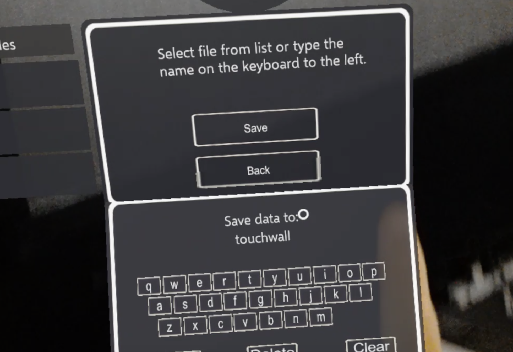
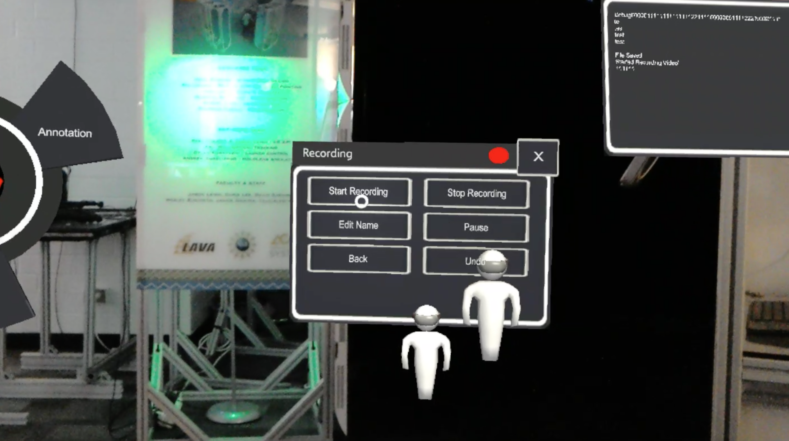
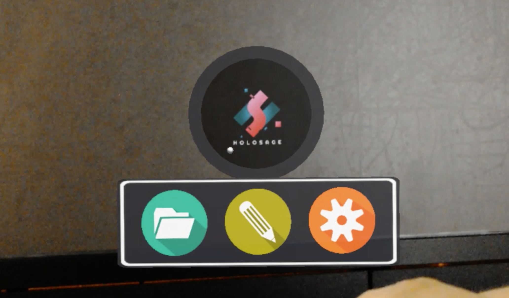
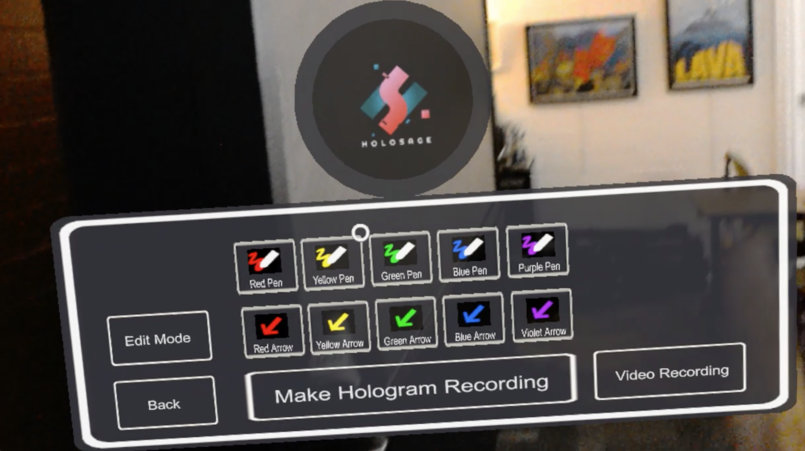

  

    <h1 class="ui center aligned header" style="font-size: 40px; color: whitesmoke">{{ page.title }}</h1>
    
    

      
C#

      
Unity

      
Augmented Reality

    

    

      HoloSage is an augmented reality training program that to allows users to create and view recorded annotations in real world space. The application was created by undergraduate students Justin Bishay and Andrew Kurano.
    

  

  

    

    

      

        
        
      

      

        

          This was my first project as part of the Laboratory for Advanced Visualization Applications (LAVA) which we were contracted by the Navy to create. The user can save these notes as recordings with audio to provide more detailed step-by-step training remotely. Users are able to draw lines, place arrows, record microphone audio, and make video recordings.
           
           
          Andrew and I divided the responsibilities for this project equally. I focused on many of the functional aspects of this program while Andrew handled the lower level systems such as file saving and loading. I wrote the code that recorded the HoloLens's microphone audio and stored it in the program for playback. We ran into numerous audio bugs later in development involving inconsistent playback speed which led me to learn much more about using audio data in programs and how to trim clips to the appropriate length at runtime.
        

      

    

    

  

  

    

    

      

        

          We wanted the annotations to feel like a true recording, so I came up with a way to automatically redraw a line exactly how the user drew it by recording timestamps for the cursor's position every update tick while the line was being drawn. Another function I implemented was the ability for the user to record a video directly from the HoloLens's camera and actually view it inside the program in case there was something a trainer needed to display to a trainee with their own hands. 
        

      

      

        
      

    

    

  

  

    

    

      

        
        
      

      

        

          A request we received from the Navy officer overseeing the project was if it was possible to make the placed hologram objects editable such that you can manipulate them after they were created. This was tricky for a few reasons. To make all the annotations into a recording, we needed to timestamp when the object was created so we could recreate it at the same point in time while viewing the playback of the recording. Stopping to edit the position or orientation of an object would cause recordings to drag on longer and make them more tedious to view since time would be wasted moving or rotating something like an arrow. 
           
           
          Despite the difficulty of this request, I managed to come up with a way to provide this feature without the aforementioned recording issue. I created an edit mode that could be accessed both while making a recording and after a recording file was made. The version of edit mode that could be used in the middle of creating a recording would completely pause the in-progress recording and allow you to freely take as much time as you wanted to edit the hologram objects however you pleased. When you were done, you could exit edit mode and continue making your recording and the playback would be continuous no pause in it at all.
           
           
          This was perhaps the most impressive part of the entire project since it required taking multiple audio clips and trimming and splicing them together from inside the HoloLens to ensure the viewer of a recording would never experience any sort of interruption. The version of edit mode that could be used on an existing recording file was much simpler, as it just loaded all of the hologram objects at once from a specific recording file and provided the ability to edit them.
        

      

    

    

  

  

    

    

      

        In the later stages of the project, I began to focus much more on the UI. Feedback on the early version of the application's UI was not great. Users constantly lost track of UI elements and they found the virtual menu not fitting into their physical space in the real world. A PhD student assisted me in restructuring the UI to hide functions whenever they were not needed in an attempt to simplify the menu view. The menu was made to be more compact to make the virtual object more portable and keep all sub menus focused into the center view of the menu object. These changes dratsically improved the UI/UX experience for users.
      

      

        

          
        

        

          
        

      

    

    

  

  

    

    

      

        Andrew graduated in May of 2018, so I became the solo lead for the project's final stages of development and thus had to learn how the entire application functioned. I learned how all the low level systems worked and proceeded to make modifications to them to improve their performance. Working on this project challenged my problem solving skills with difficult tasks. Many of the features we sought to implement had not been previously done with augmented reality (AR), so the code samples and algorithms for the functions we wanted were quite limited. A lot of what we made required us to come up with original solutions. It also taught me how to design user interfaces to be simple, intuitive, and help streamline the process of using the program.
         
         
        This projected was presented to several military officers at a tech showcase event in October of 2018. Fun little story about this, I was not told until I arrived at the event that I needed to be ready with a 2-3 minute elevator pitch to present it to all of the officers at once. I managed to come up with one in about 15 minutes while preparing the demo for them. My strategy was to equate the tech to the experience of creating and viewing a YouTube video but in real life space instead of a computer screen, and they ended up really liking what I had to say!
         
         
        You can watch HoloSage in action in the linked video here:
      

      

        <iframe width="900" height="506" src="https://www.youtube.com/embed/U8wsWn5IBE4" frameborder="0" allow="accelerometer; autoplay; encrypted-media; gyroscope; picture-in-picture" allowfullscreen></iframe>
      

    

    

  

