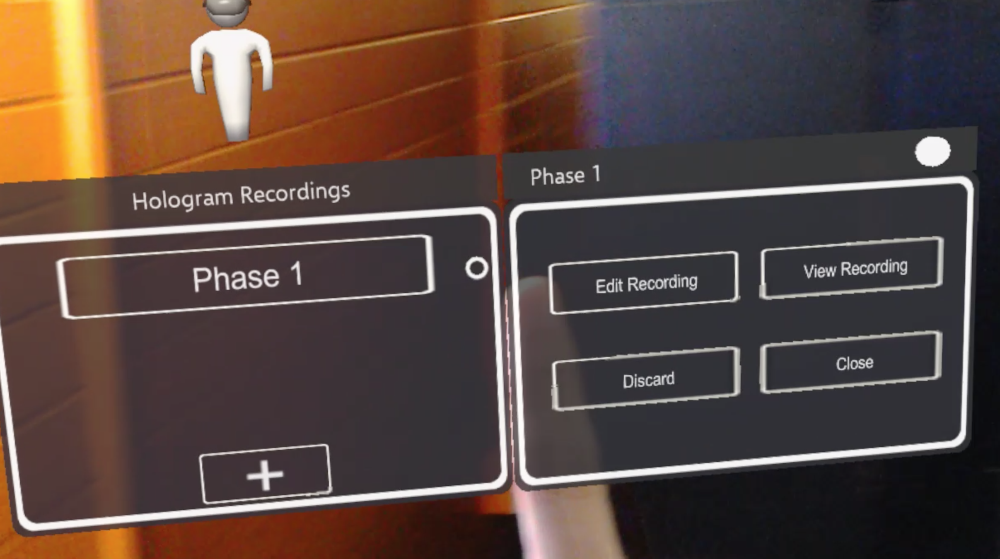
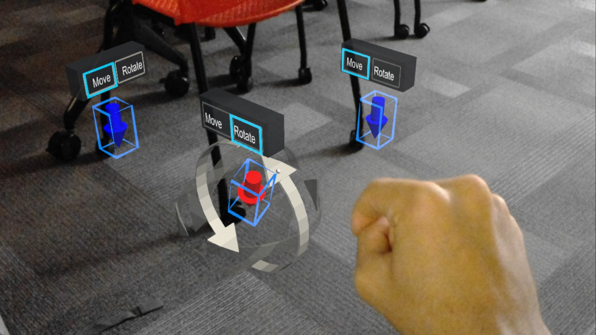
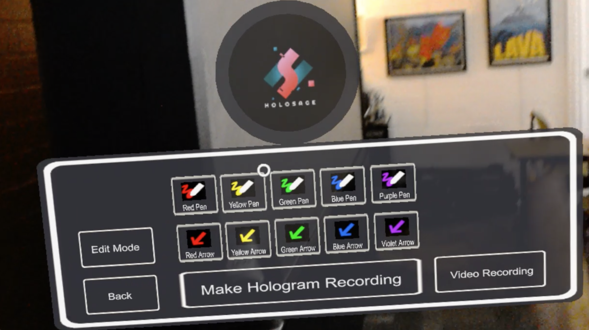
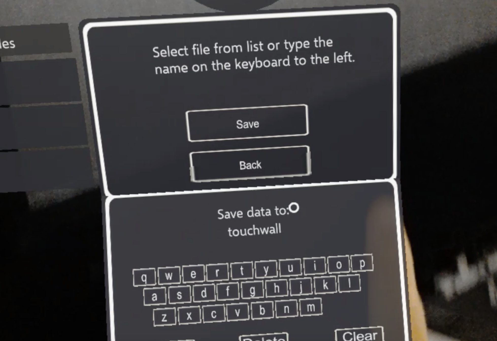

  
Augmented Reality

  
Unity

  
C#

 

HoloSage is an augmented reality training program designed to allow users to create annotations in real world space. This was my first project as part of the Laboratory for Advanced Visualization Applications (LAVA) which we were contracted by the Navy to create. The user can save these notes as recordings with audio to provide more detailed step-by-step training remotely. Users are able to draw lines, place arrows, record microphone audio, and make video recordings. This program was developed for the Microsoft HoloLens and was programmed in Unity with C#. It was created by undergraduate students Justin Bishay and Andrew Kurano.

Andrew and I divided the responsibilities for this project equally. I focused on many of the functional aspects of this program. I was responsible for creating the code that recorded the HoloLens's microphone audio and stored it in the program for playback. We ran into numerous audio bugs later in development which led me to learn much more about using audio data in programs and how to trim clips to the appropriate length at runtime. I came up with a way to automatically redraw a line exactly how the user drew it by using timestamps. Another function I implemented was the ability for the user to record a video directly from the HoloLens's camera and actually view it inside the program. I also had to come up with a way to manipulate objects that made sense for users so that they could edit the holograms after creating them.

Working on these tasks also gave me a lot of experience working on user interface (UI). For the first time in my career I had to carefully ponder over how a user would interact with our program. People would often make a bit of a mess of our program in its earlier stages of development. As a result, we had to restructure our UI so that certain functions were not available whenever they were not needed and could cause problems. I spent a good amount of time working on organizing our menus so that they grouped content together appropriately, were fairly easy to use, and made sense to the user. 

Andrew graduated in May of 2018, so I became the lead for the project's final stages of development. At this point I learned all about how the application functioned. I proceeded to make modifications to the system based on what Andrew had implemented to make it run smoother. I also began to focus much more on the UI at this stage of the project to make it into a fully functioning application that could be utilized by others. 

Working on this project challenged my problem solving skills with difficult tasks. Many of the features we sought to implement had not been previously done with augmented reality (AR), so the code samples and algorithms for the functions we wanted were quite limited. A lot of what we made required us to come up with original solutions. It also taught me how to design user interfaces to be simple, intuitive, and help streamline the process of using the program.

This project was my first experience of working with AR. Prior to this I mainly focused on using Unity for game development, so it was a very eye opening opportunity for me to see what kind of practical applications could be created with game engine software. Since starting this project, I have continued to explore AR development with personal and professional projects. 

  <iframe width="700" height="394" src="https://www.youtube.com/embed/U8wsWn5IBE4" frameborder="0" allow="accelerometer; autoplay; encrypted-media; gyroscope; picture-in-picture" allowfullscreen></iframe>

  

    
    
    
  

  

    
    
    
  

