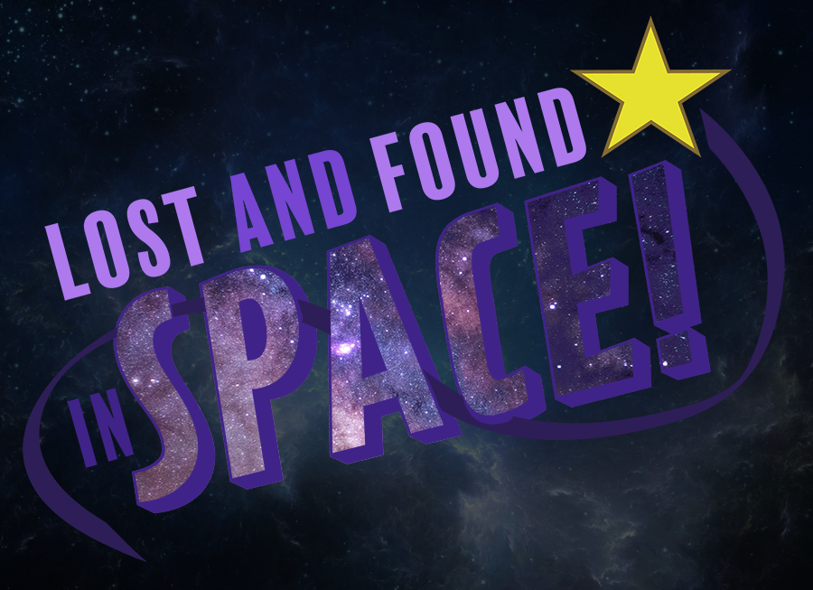

  
Game Design

  
Unity

  
C#

 

"Lost and Found: In Space" is a two player cooperative action puzzle game. One player is trapped in a room where they must survive a barrage of hazards being thrown at them while they're partner frantically searches to save them. The player who is searching must be careful to solve puzzles to navigate through the maze because if they make a mistake their friend will face more difficult obstacles to survive against. 

This game was made in 72 hours for Global Game Jam 2021. I worked in a group of four people which included two programmers and two artists to make this game. It was a good opportunity to collaborate with artists to integrate assets along with my own code into a project. In addition to asset integration, I was responsible for designing the gameplay for the player who must survive in the death room. 

  

    
    
  

  

  

