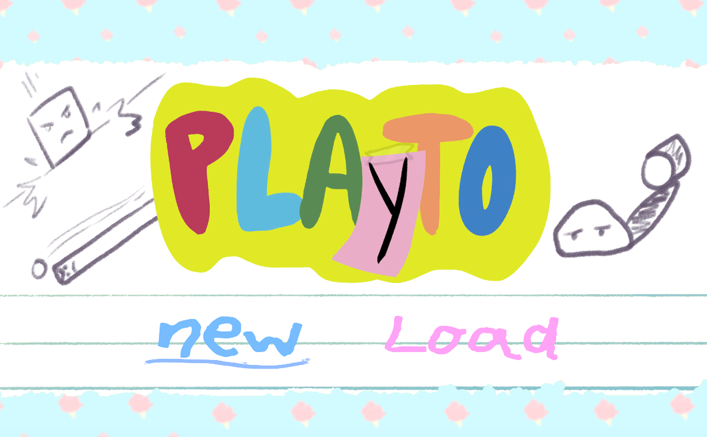
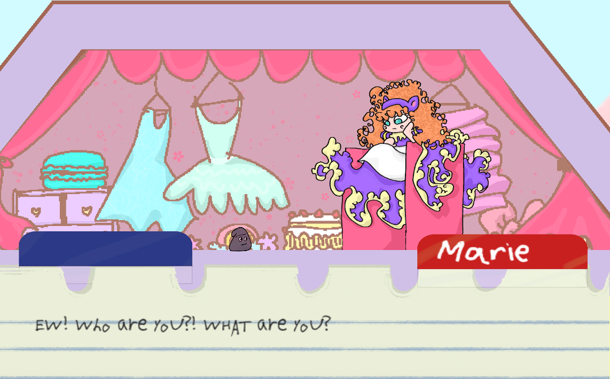
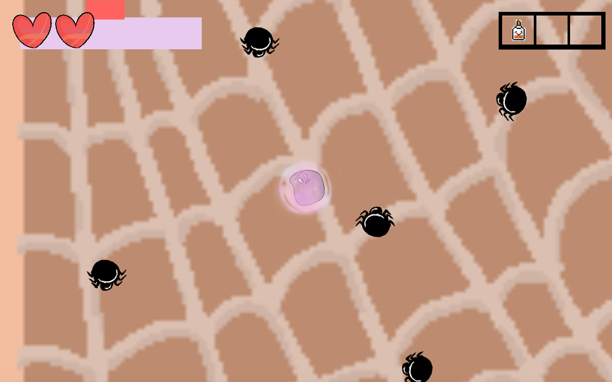
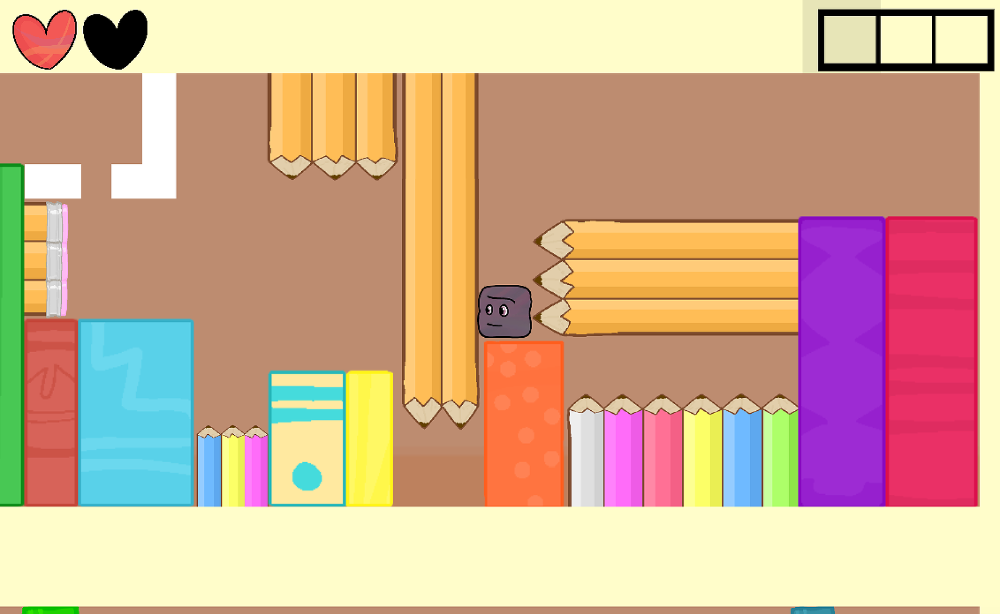
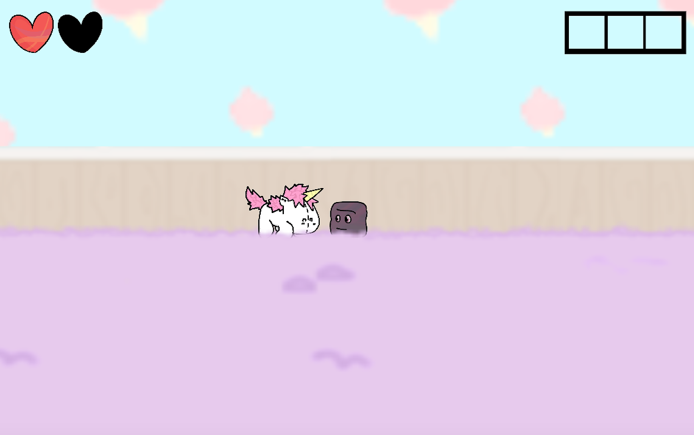

  
Game Design

  
Unity

  
C#

"Playto" is a 2D puzzle platformer where the player is a piece of playdough and they can morph into different shapes to navigate levels and solve puzzles. The game was developed in Unity and coded in C#.
This game is a collaborative game design project between Computer Science and Animation undergraduate students: Justin Bishay, Neil Teves, Michael Mangrobang, Kayla Abalos, and Kaeli Giron.

For this project, I programmed and designed many of the puzzles that were featured in our levels. I also helped to draw out and organize the layout of our levels. While designing the levels and puzzles, I took extra care to ensure that the puzzles were neither too difficult nor too easy. My programming responsibilities also included working on the game's cinematics with the camera movements and implementing the dialogue for our cutscenes. In addition to this, I implemented the audio for our game and created some of the sound effects. I also helped to fix any bugs with the levels and game mechanics throughout the project. 

This project taught me a lot about how to design a truly good game. I learned to focus on the more important aspects of designing a video game and to take care to not be distracted by trying to come up with an amazing story, visuals, or outrageous mechanics. On the technical side, I was able to expand my knowledge of Unity and C#. I learned many different tips and tricks about designing certain things in Unity and I learned how to manipulate the camera to achieve the desired aesthetic effect. 

Check out a short trailer for the game [here!](https://youtu.be/3oDPTKcFKlY)

You can learn more about our game at its [website.](https://dreamingbento.github.io/)

  

    
    
  

  

    
    
  

