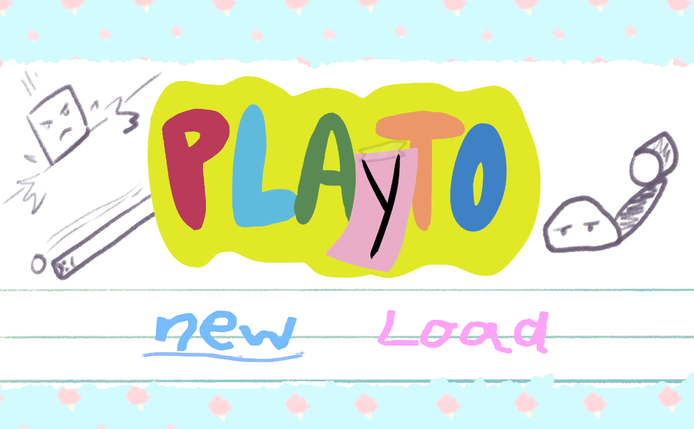
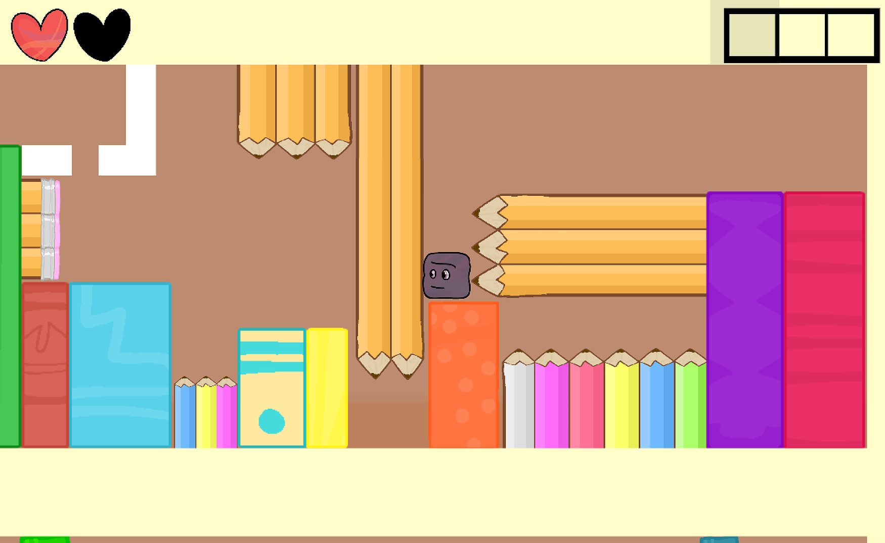
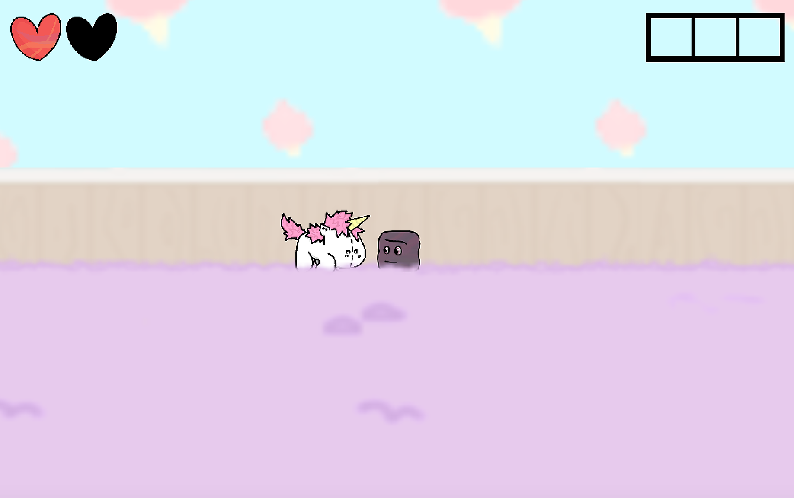
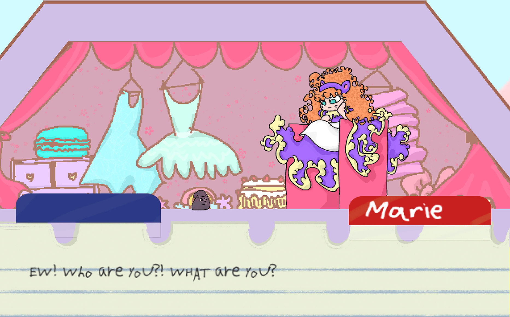
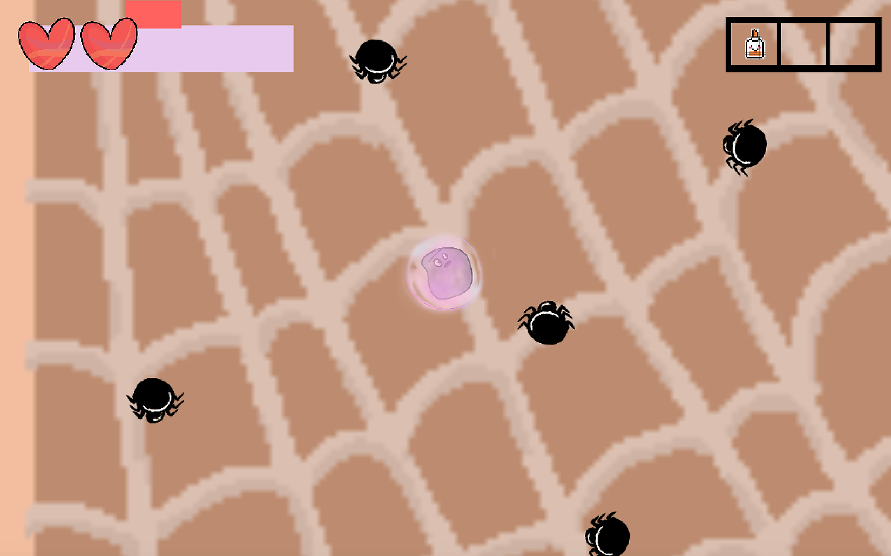

  

    <h1 class="ui center aligned header" style="font-size: 40px; color: whitesmoke">{{ page.title }}</h1>
    
    

      
C#

      
Unity

    

    

      "Playto" is a 2D puzzle platformer where the player is a piece of playdough and they can morph into different shapes to navigate levels and solve puzzles. This project was made by Computer Science and Animation undergraduate students Justin Bishay, Neil Teves, Michael Mangrobang, Kayla Abalos, and Kaeli Giron.
    

  

  

    

    

      

        
        
      

      

        

          For this project, I programmed and designed many of the puzzles that were featured in our game. I also helped to draw out and organize the layout of our levels. While designing the levels and puzzles, I took extra care to ensure that the puzzles were neither too difficult nor too easy.
        

      

    

    

  

  

    

    

      

        

          My programming responsibilities also included working on the game's cinematics with the camera movements and implementing the dialogue for our cutscenes. In addition to this, I implemented the audio for our game and created some of the sound effects. I also helped to fix any bugs with the levels and game mechanics throughout the project. 
        

      

      

        
        
      

    

    

  

  

    

    

      

        

          This project taught me a lot about how to design a game. I learned to focus on the gameplay experience rather than trying to come up with an amazing story, visuals, or outrageous mechanics. On the technical side, I was able to expand my knowledge of Unity and C#. I learned many different tips and tricks about implementing certain functions in Unity, and I learned how to manipulate the camera to achieve desired cinematic effects. 
           
           
          You can learn more about our game and find a playable demo at its <a href="https://dreamingbento.github.io/">website</a>.
        

      

      

        <iframe width="900" height="506" src="https://www.youtube.com/embed/3oDPTKcFKlY" frameborder="0" allow="accelerometer; autoplay; encrypted-media; gyroscope; picture-in-picture" allowfullscreen></iframe>
      

    

    

  

