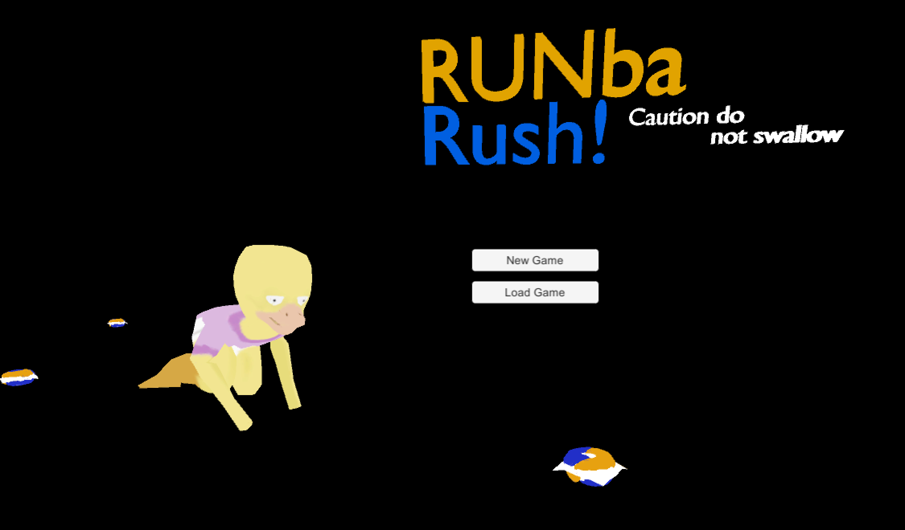
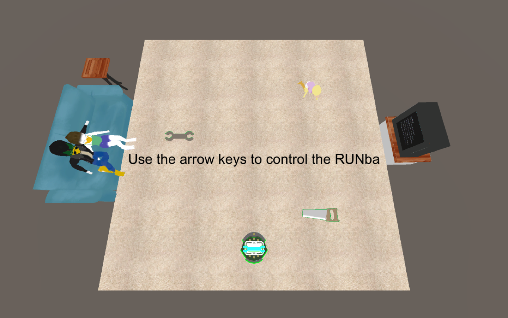
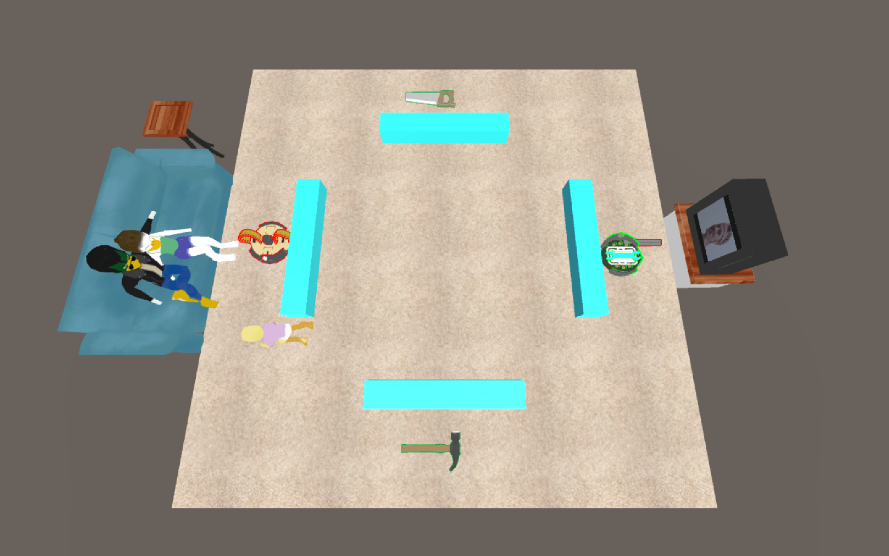
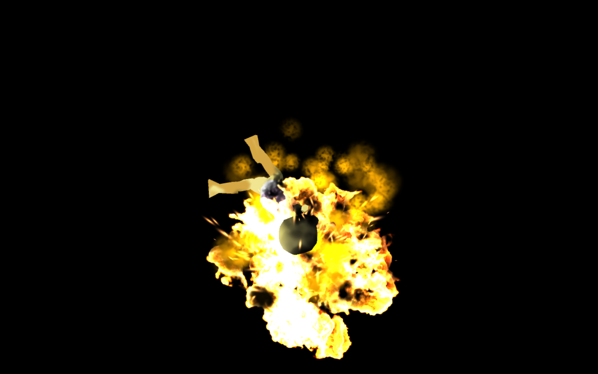
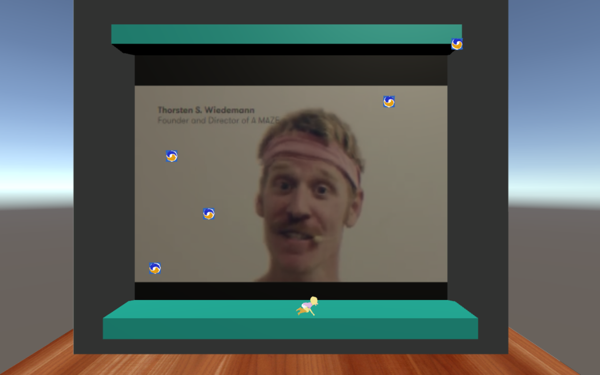

  

    <h1 class="ui center aligned header" style="font-size: 40px; color: whitesmoke">{{ page.title }}</h1>
    
    

      
C#

      
Unity

    

    

      RUNba Rush is a puzzle game where the player assumes the role of a babysitter who must use dysfunctional Roo- err, RUNbas to clear the house of hazardous objects before the toddler eats them. It was created by a team of five people for Global Game Jam 2018.
    

  

  

    

    

      

        
        
      

      

        

          I was designated as the sole programmer for this project which left me in charge of designing the game's overall mechanics. I spent a lot of time learning more about rotations in Unity and how to properly manipulate them. There were numerous complications involving quaternions and euler angles that required additional research on my part to better understand their usage. In addition to this, I also had to create our AI for the toddler to continuously target and chase the nearest hazard.
           
           
          This was a particularly enjoyable part of the project as I was able to learn how to use Unity's built-in navigation mesh system to set up an autonomous pathfinding AI. This project also gave me the opportunity to learn how to use Unity's scene manager to switch between the main menu and different levels. Aside from coding, I worked on the level design for the game as well. 
        

      

    

    

  

  

    

    

      

       This was my first time participating at a coding challenge. I got to experience what it is like working under pressure to meet a deadline. Global Game Jam was a very unique experience. It really tested my creativity in trying to come up with a fresh idea based off of our given theme. We were given additional 'diversifiers' as extra criteria to make our games more interesting. That led us to making a secret level where the Global Game Jam hype video played in the background. Despite the lack of sleep, it was a tremendous amount of fun and very rewarding.
      

      

        

          
        

        

          
        

      

      

        

          You can check out the game jam site for our game <a href="https://globalgamejam.org/2018/games/runba-rush">here!</a>
        

      

    

    

  

