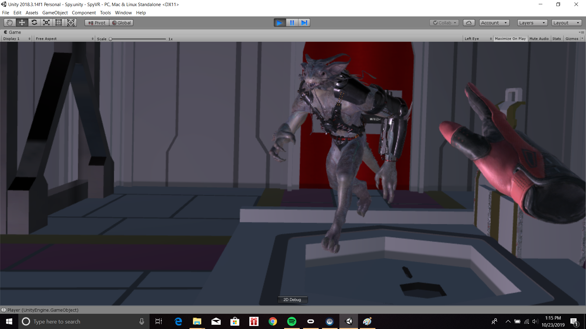

  
Virtual Reality

  
Networking

  
Game Design

  
Unity

  
C#

 

"Sneaky People In Extreme Situations," or "S.P.I.E.S.," is a virtual reality multiplayer spy game. One player puts on a VR headset and must navigate through a building to search for and steal a hard drive while avoiding guards and unlocking doors. The spy is assisted by another player not in VR who acts as the operator. The operator is able to track the location of the spy as he or she moves through the building and must help the spy solve puzzles, find the hard drive, and escape. This project was for a virtual and augmented reality class and was created by Justin Bishay, Dylan Kobayashi, and Katrina Turner.

My primary repsonsibilities for this project were to work on the VR aspects of the program and the AI of the guards. I decided to implement a movement scheme that used the controller's joystick to move the player smoothly through the environment as opposed to teleportation schemes in order to preserve the player's immersion as a spy. I also had to make some modifications to the VR player rig to restrict and prevent players from phasing through walls. 

I used Unity's NavMesh system for the guards' AI to generate a walkable area and set waypoints for it to randomly patrol between. I also made use of Unity's NavMeshObstacle components to make the walkable area dynamicly change as doors are opened and closed. However, I had to design a finite-state machine for the AI since it was meant to switch between patroling and chasing. I also had to manually create a method for the guard to locate the player when he or she is in its line of sight using raycasts. 

The project gave me great experience developing applications for virtual reality as I learned more about the smaller details that need to be considered when designing such programs. 

  

    
    
  

  

    
    
  

