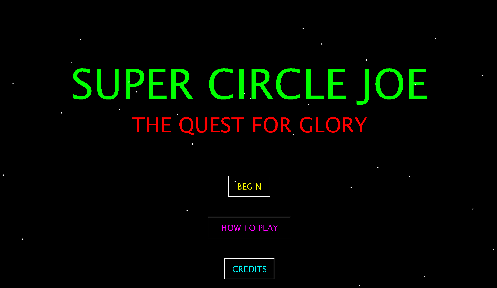
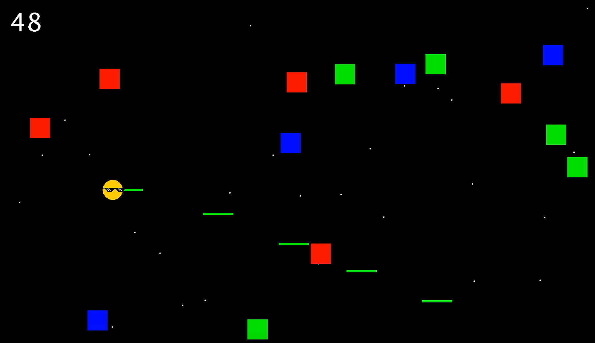
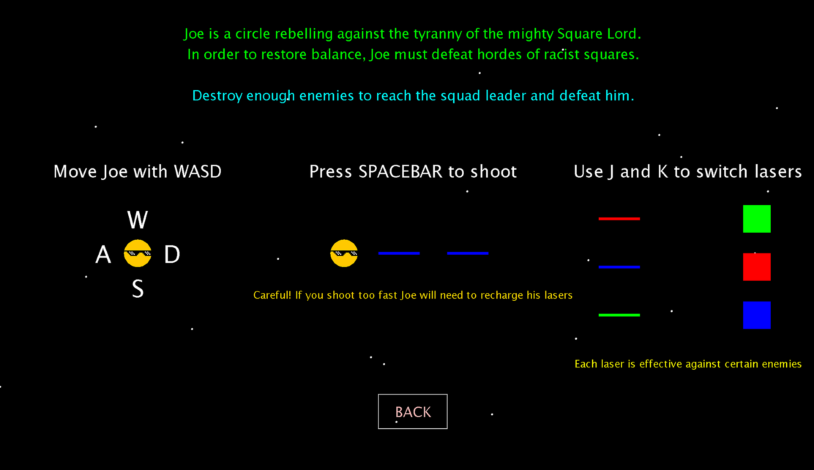
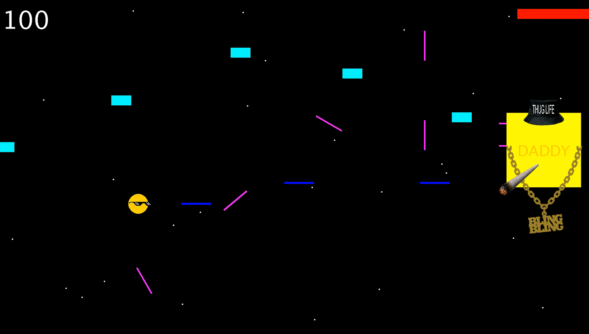
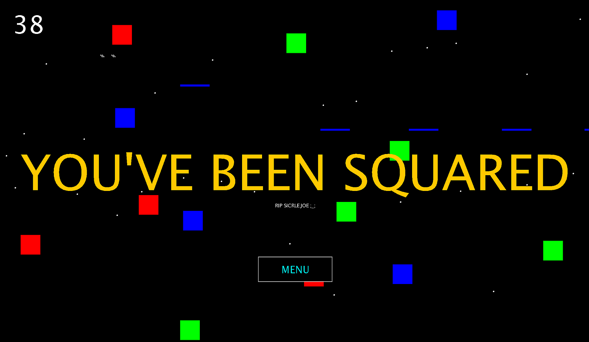

  
Game Design

  
Java

"Super Circle Joe" is a 2D arcade-style shooter with comedic elements where the player must attack and dodge numerous waves of enemies. The player must switch the color of their attacks to correspond to the enemies they face in order to defeat them efficiently. There is a boss battle at the end of the level that the player can reach after defeating a certain amount of enemies. I developed this game myself as a personal project in Java.

I created this project as a means to further my knowledge and understanding of Java. This project helped me to learn how to better code more rigorous algorithms and solve more complex problems. This was also my first experience in designing a video game. While the game was simple, I still had to tackle issues such as finding an optimal control scheme, properly setting the difficulty, and making the game's mechanics creative and fresh. I got a lot of practice in coding by doing this project, and I learned how to various find bugs and fix them efficiently. 

  

    
    
    
    
  

